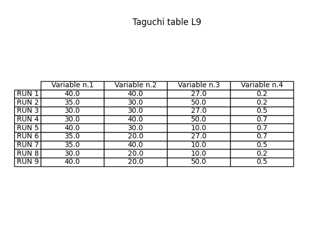

# pyTaguchi
Taguchi designs made easy.
More infos about: [Engineering Statistics Handbook](https://www.itl.nist.gov/div898/handbook/pri/section5/pri56.htm)

## Changelog
### v.0.3
- Added L12 Taguchi design.
#### v.0.2
- Added function to randomize runs
#### v.0.1
- Initial Release
- Added L4, L9, L16b and L8 Taguchi designs. 


## Installation

pyTaguchi has been built on Python 3.9.2

To install this package simply run

```sh
pip install pyTaguchi
```

## Use

1. Import in your project 
```sh
import pyTaguchi
```
2. Define your variables
```sh
var1 = {
  "name": "Variable n.1",
  "values": [30, 35, 40]
}   

var2 = {
  "name": "Variable n.2",
  "values": [20, 30, 40]
}  

var3 = {
  "name": "Variable n.3",
  "values": [10, 27, 50]
}  

var4 = {
  "name": "Variable n.4",
  "values": [0.2, 0.5, 0.7]
} 
```
3. Create object and add variables
```sh
tg = Taguchi()
tg.add(var1)
tg.add(var2)
tg.add(var3)
tg.add(var4)
```
4. Run and get plotted matrix 
```sh
tg.run()
```
... or if you want to randomize the runs: 
```sh
tg.run(randomize=True)
```
5. Expected output



## License

MIT